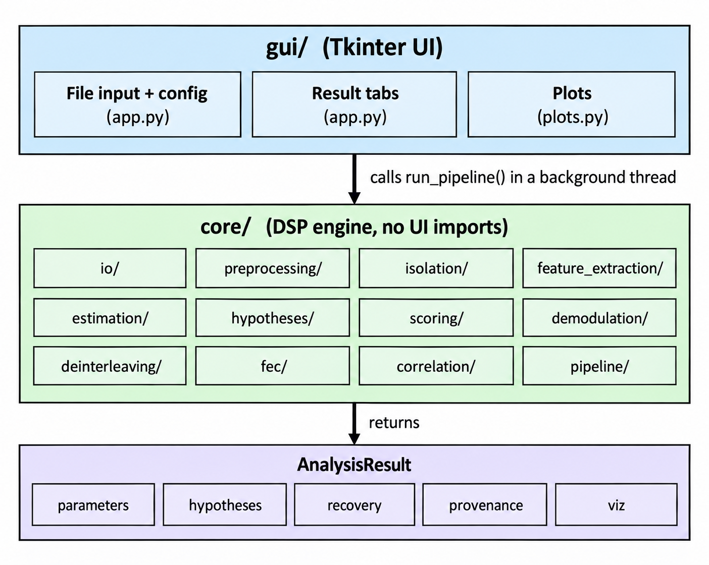
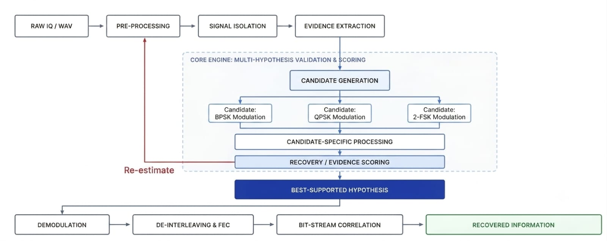
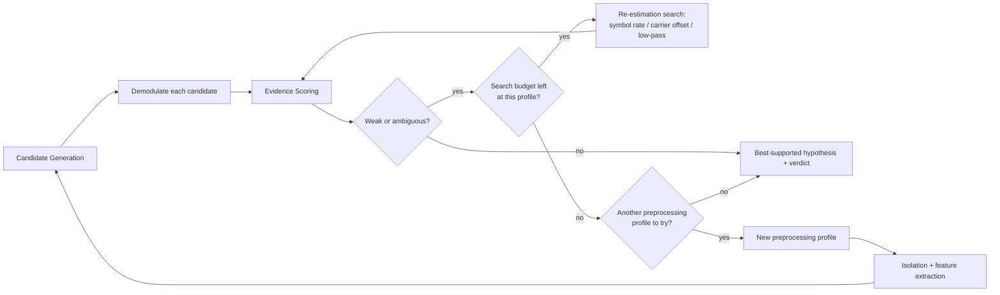
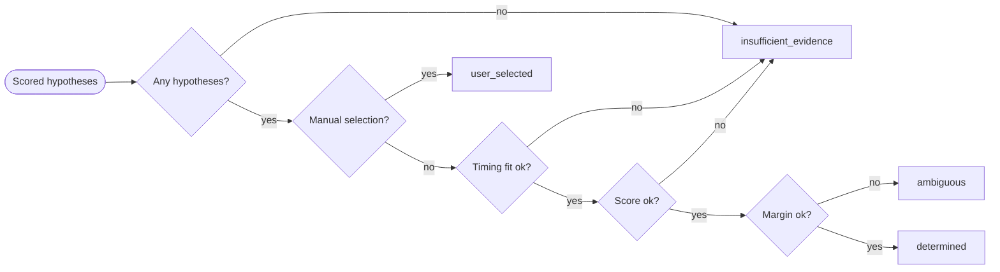
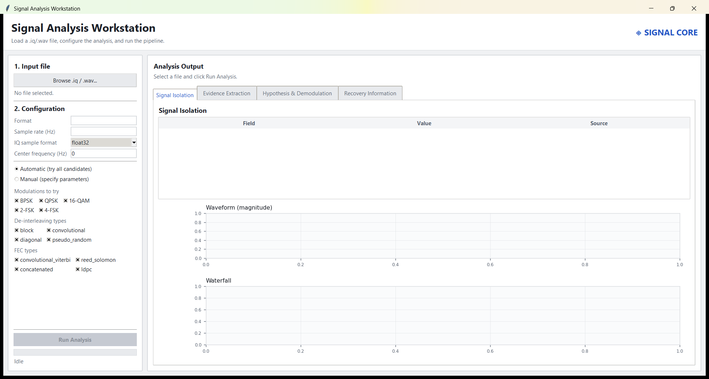
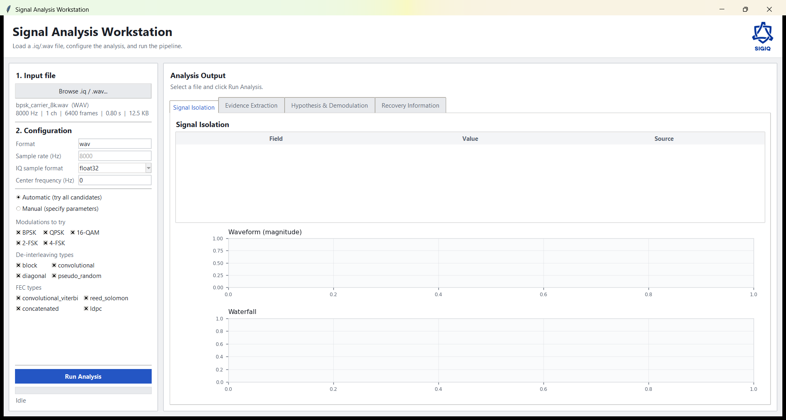
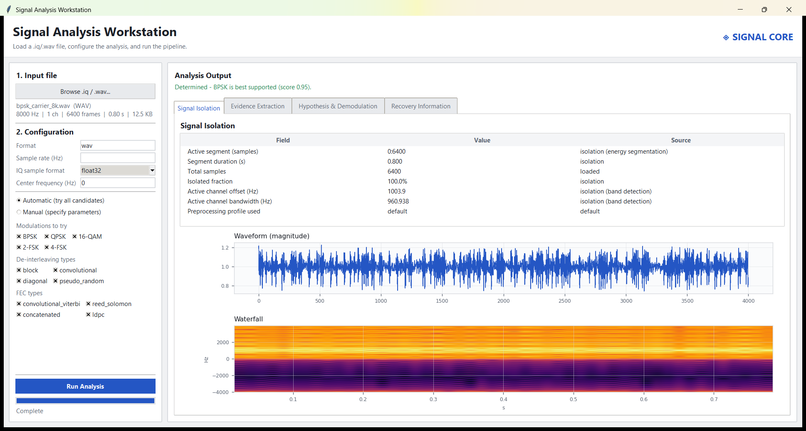
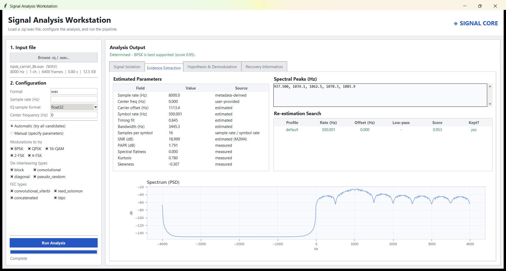
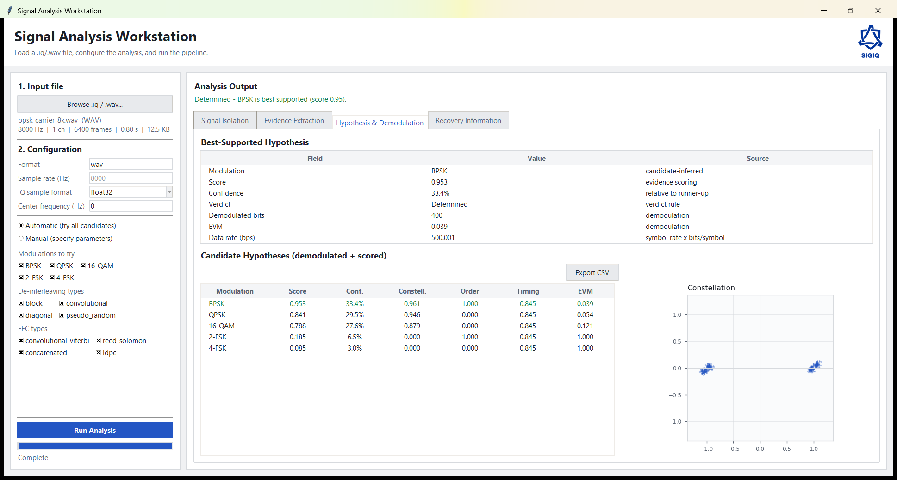
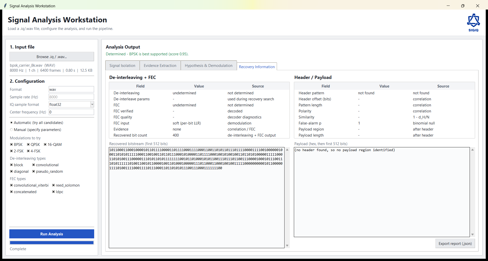

<div align="center">


# SigIQ

### Signal Analysis Workstation for automated RF signal identification and recovery

[](https://www.python.org/)
[](https://docs.python.org/3/library/tkinter.html)
[](https://numpy.org/)
[](#-installation)
[](#-testing)
[](#-features)

<br/>

**Feed it a raw `.iq` or `.wav` recording. It tells you the modulation, the real transmission
parameters, and, if the bits decode, the recovered payload. Every number is computed live,
labelled by where it came from, and it says "I don't know" when the evidence doesn't support an answer.**

<br/>

[**Installation**](#-installation) · [**Features**](#-features) · [**Architecture**](#-architecture) · [**Pipeline Flow**](#-pipeline-flow) · [**Interface Walkthrough**](#-interface-walkthrough) · [**Tech Stack**](#-tech-stack) · [**Accuracy**](#-accuracy) · [**Known Limitations**](#-known-limitations) · [**Contributing**](#-contributing)

</div>

<br/>

---

## 🧠 Overview

A radio transmission is just a stream of bits encoded onto a wave, but unlike a `.jpg` or `.mp3`,
there's no universal file format for it. The sender and receiver privately agree in advance on how
fast bits are sent, how 0s and 1s are represented as changes in the wave, whether extra data is mixed
in to survive noise, and whether a fixed pattern marks where the real content starts. Knowing that
agreement is normally a precondition for reading the signal at all.

SigIQ works the other way around: given only a raw recording, with none of that context, it tests the
reasonable possibilities for each of those unknowns and reports which combination the data actually
supports, plus the recovered bits, if enough of the signal survived. (A loose analogy: transcribing
a recording of speech in an unidentified language, rather than being told in advance which language
it is.)

Given a raw `.iq` (headerless interleaved I/Q binary) or `.wav` recording, SigIQ determines, end to end and with **no manual DSP work**:

| Question | How it is answered |
|---|---|
| **What modulation is being used?** | Demodulates against every candidate (BPSK, QPSK, 16-QAM, 2-FSK, 4-FSK) and scores which one the data actually supports best. |
| **What are the real transmission parameters?** | Sample rate, symbol rate, carrier offset, bandwidth, and SNR, each labelled as *user-provided*, *read from a file header*, *estimated*, or *inferred from the winning candidate*. |
| **Are the bits interleaved and/or FEC-coded?** | A joint search over de-interleaving (block, convolutional, diagonal, pseudo-random) and FEC (Viterbi, Reed-Solomon, concatenated, LDPC), kept only if a header match or a verifying decoder supports it. |
| **Is there a recognizable header/payload?** | Correlation against known sync words (CCSDS ASM, HDLC flag, Barker-11), backed by a statistical false-alarm test, not a similarity guess. |

> If the evidence is weak, or the signal is ambiguous between two hypotheses, SigIQ says so
> (`ambiguous` or `insufficient_evidence`) instead of forcing a confident-looking wrong answer.

<br/>

<details>
<summary><b>📖 Glossary of terms used in this README</b></summary>
<br/>

| Term | Plain-English meaning |
|---|---|
| **IQ / `.iq` file** | The raw recorded radio wave, stored as numbers instead of sound: the rawest form of a captured signal, with no built-in description of what it contains. |
| **Modulation** (BPSK, QPSK, 16-QAM, 2-FSK, 4-FSK) | The "alphabet" the sender used to turn bits into wave changes. Different modulations pack different amounts of data per wave cycle and tolerate noise differently, like choosing between Morse code, semaphore, or full sentences. |
| **Symbol rate** | How fast the sender is changing the wave: how fast it's "speaking." |
| **Carrier offset** | How far the actual signal drifted from the frequency you expected to find it at. |
| **SNR (Signal-to-Noise Ratio)** | How clean the recording is: high SNR means a clear signal, low SNR means it's buried in static. |
| **Bandwidth** | How much of the radio spectrum (how wide a "slice" of frequencies) the signal occupies. |
| **Interleaving** | A scrambling step some transmitters apply on purpose, so that if a chunk of the signal gets corrupted, the damage is spread out thin instead of wiping out one whole piece of the message; un-scrambling it is a prerequisite to reading the data. |
| **FEC (Forward Error Correction)** (Viterbi, Reed-Solomon, LDPC, etc.) | Extra bits the sender adds on purpose so the receiver can detect *and fix* small errors caused by noise, without needing to ask for a retransmission, like a spell-checker built into the message itself. |
| **LLR (soft bit / Log-Likelihood Ratio)** | Instead of the demodulator committing early to "this bit is definitely a 0," it keeps a confidence score ("probably a 0, but not certain"). Feeding that confidence into the error-correction step (rather than throwing it away) recovers more of the message from noisy signals. |
| **EVM (Error Vector Magnitude)** | A measurement of how far each received symbol landed from where it was supposed to land: a cleanliness score for the demodulation itself. |
| **Sync word / header** (CCSDS ASM, HDLC flag, Barker-11) | A known, fixed bit pattern some transmission standards put at the start of each message, purely so a receiver can find "here's where the real content begins." Recognizing one of these patterns is a strong clue about which standard is in use. |
| **Hypothesis** | One guess at "the modulation is X, the symbol rate is Y, etc." SigIQ tests many hypotheses and scores each one against the actual recording, rather than assuming one is correct. |
| **Verdict** (`determined` / `ambiguous` / `insufficient_evidence`) | SigIQ's own honesty label on its answer: "confident," "torn between two options," or "not enough signal to say," instead of always picking a winner. |

</details>

<br/>

## 🧩 Features

| Module | Description |
|---|---|
| 📥 **File Input** | Loads headerless `.iq` (raw interleaved I/Q) or `.wav` recordings; reads whatever metadata a `.wav` header actually carries. |
| 🎚 **Signal Isolation** | Energy-based segmentation and strongest-channel detection, with the waveform and waterfall of exactly what was isolated. |
| 📊 **Evidence Extraction** | Spectral, temporal, and statistical features, plus symbol rate, carrier offset, and bandwidth estimation with a full re-estimation search trace. |
| 🧪 **Multi-Hypothesis Scoring** | Every candidate modulation is demodulated and scored on constellation fit, order consistency, and timing fit, not just the winner. |
| 🛰 **Demodulation** | PSK, QAM, and FSK demodulators, each emitting soft per-bit LLRs alongside hard bits. |
| 🔗 **De-interleaving + FEC** | Block, convolutional, diagonal, and pseudo-random de-interleavers; Viterbi, Reed-Solomon, concatenated, and LDPC decoders, searched jointly, soft-decision where supported. |
| 📡 **Bit-Stream Correlation** | Known sync-word matching (CCSDS ASM, HDLC flag, Barker-11) backed by a statistical false-alarm test. |
| 📤 **Export** | Hypotheses and the full analysis report as CSV / JSON. |

<details>
<summary><b>🔒 The design rule behind every result (click to expand)</b></summary>
<br/>

**Never hardcode a detected result, confidence value, sample rate, FEC outcome, or plot value.**
Every number shown in the UI is computed from the loaded signal, on that run, by the code in `core/`.
Some concrete guarantees that follow from that rule:

- A **"decoded"** result only appears if a decoder's parity/syndrome check genuinely passes, or a Viterbi decode's bit-mismatch rate is statistically far enough below what a random stream produces (a z-test against a random-stream baseline, not a fixed threshold).
- A **"header found"** result only appears if the correlation peak clears a binomial false-alarm test at `p < 0.01`, Bonferroni-corrected across the sync words tried.
- **Pure noise input** is reported as `insufficient_evidence` with nothing recovered, verified by a test that feeds the pipeline seeded random noise and asserts nothing downstream fires.
- **Soft-decision (LLR)** information from demodulation is threaded through de-interleaving into Viterbi/LDPC decoding when available, instead of being discarded in favor of hard 0/1 bits. Measured to cut output BER from **14.6% → 0.4%** at the same SNR in one Viterbi test case.

</details>

<br/>

---

## 🏛 Architecture

SigIQ follows a strict **two-layer, one-direction** architecture: control only ever flows downward,
data only ever flows back up as a single result object, and the DSP engine has no idea a GUI exists.

<div align="center">

</div>

| Layer | Role |
|---|---|
| **`gui/`** (Tkinter UI) | File input and configuration, the four result tabs, and the plots, all in `app.py` and `plots.py`. Its only job is to call `run_pipeline()` and render whatever comes back; it contains no signal-processing code of its own. |
| **`core/`** (DSP engine) | Twelve packages covering the whole signal chain, from loading through the pipeline orchestrator itself. None of them import anything from `gui/`, which is what makes `core/` runnable and testable completely on its own. |
| **`AnalysisResult`** | The one object `core/` hands back: estimated parameters, scored hypotheses, recovered bits, a provenance label for every value, and the visualization data the plots render. The GUI never reaches back into `core/` for anything not already in this object. |

`core/` is directly testable and runnable with no GUI involved at all. See `tests/test_pipeline_smoke.py`, which builds a synthetic BPSK signal and runs it through the full pipeline:

```bash
python -m tests.test_pipeline_smoke
python -m tests.test_behaviour
python -m tests.test_ldpc
```

<br/>

---

## 🔀 Pipeline Flow

Implemented in `core/pipeline/analyzer.py`:

<div align="center">

</div>

**Reading the diagram:**

1. **Raw IQ / WAV → Pre-processing → Signal Isolation → Evidence Extraction.** The file is loaded, DC offset and power are normalized (with optional denoising), the active segment and channel are isolated, and spectral/temporal/statistical features plus initial parameter estimates are extracted.
2. **Core engine: multi-hypothesis validation and scoring.** Candidate modulations (BPSK, QPSK, 16-QAM, 2-FSK, 4-FSK by default) are generated in parallel. Each one is demodulated and scored on constellation fit, order consistency, and timing fit **inside this box, not after it**: a candidate cannot be scored without being demodulated first.
3. **Re-estimate.** If the result is weak or ambiguous, the search retries. Most retries are a bounded coordinate search over symbol rate, carrier offset, and low-pass cutoff that loops straight back into evidence scoring using the samples already isolated; the diagram's arrow back to "Pre-processing" represents the fallback case, when that search is exhausted and a new preprocessing profile is tried from scratch.
4. **Best-Supported Hypothesis.** The winner's verdict is one of `determined`, `ambiguous`, `insufficient_evidence`, or `user_selected`, and its bits (already produced during scoring) carry forward. No modulation is ever named with unsupported confidence.
5. **De-interleaving & FEC → Bit-stream Correlation → Recovered Information.** De-interleaving and FEC are searched jointly, not as a fixed chain, ranked by header correlation and FEC success. Known sync-word matching then locates a header/payload region if the false-alarm test allows it.

<details>
<summary><b>📜 Exact stage-by-stage detail (click to expand)</b></summary>

```text
Input Loader (iq_reader / wav_reader, metadata_parser)
  -> Preprocessing profile (DC removal, power normalization, optional denoising)
  -> Isolation (energy-based segmentation, strongest-channel detection)
  -> Feature Extraction (spectral, temporal, statistical)
  -> Parameter Estimation (symbol rate, carrier offset, bandwidth)
  -> Candidate Generation (BPSK / QPSK / 16-QAM / 2-FSK / 4-FSK candidate objects)
  -> Candidate-specific processing + Evidence Scoring
       each candidate is demodulated; per-metric scores are kept:
       constellation_fit, order_consistency, timing_fit
  -> Re-estimation search (only if weak or ambiguous)
       bounded search over symbol rate, carrier offset and low-pass cutoff,
       objective = best score, stops when an iteration gains < 0.005 or after
       3 iterations; if still weak, the next preprocessing profile is tried
  -> Best-supported hypothesis + verdict
       determined / ambiguous / insufficient_evidence / user_selected
  -> De-interleaving x FEC decoding, searched jointly
       ranked by header correlation + FEC success; reported "undetermined"
       if nothing shows real evidence
  -> Known sync-word matching (CCSDS ASM, HDLC flag, Barker-11)
       a match counts only if its false-alarm probability is < 0.01; both
       bit polarities are tried and an inverted stream is corrected
  -> Header / payload extraction (hex, bytes and bits)
  -> Recovered information
```

</details>

### Inside the core engine: scoring and re-estimation

The pipeline image draws one "Re-estimate" arrow back to pre-processing, which is really the fallback
of **two nested retry loops**:



The **inner loop** (`RS → ES`) is the one that fires on almost every weak/ambiguous result: it
re-scores at nearby symbol-rate/offset/cutoff points without leaving the current preprocessing profile.
The **outer loop** (`PP → ISO → CG`) is what the pipeline image's single arrow actually represents: it
only runs once the inner search is exhausted and the result is still weak, and it starts over from a
new preprocessing profile.

### Verdict decision logic

Implemented in `core/scoring/verdict.py`, checked in this exact order:



> **Timing fit ok:** at or above the minimum timing-fit threshold.
> **Score ok:** the best score is at or above the minimum score.
> **Margin ok:** the best score beats the runner-up by at least the ambiguity margin.

<br/>

---

## 🚀 Installation

```bash
# conda (recommended): creates the "iqfile" environment
conda env create -f environment.yml
conda activate iqfile

# or plain pip on Python 3.10+ (Tkinter must be available)
pip install -r requirements.txt
```

**Run it:**

```bash
python main.py
```

The window opens maximized. The left panel handles file input and configuration. The right panel has
four tabs, one per pipeline stage, each carrying its own plots alongside its data.

| Tab | Contents |
|---|---|
| **Signal Isolation** | Active segment, isolated channel, preprocessing profile, plus the waveform and waterfall of what was isolated. |
| **Evidence Extraction** | Estimated parameters, spectral peaks, the re-estimation search trace, plus the spectrum (PSD) they were measured from. |
| **Hypothesis & Demodulation** | The best-supported hypothesis, every scored candidate, plus the constellation of the winning hypothesis's own demodulated symbols. |
| **Recovery Information** | De-interleaving/FEC choices, the recovered bitstream, header, and payload. |

Hypotheses and the full report can be exported as CSV / JSON. Try it with the files in `samples/`.

<br/>

---

## 🖥 Interface Walkthrough

The screenshots below are the actual, live application (captured via `PrintWindow` on its own window,
not mocked up), analyzing `samples/bpsk_carrier_8k.wav`.

<table>
<tr>
<td width="50%">

**Idle state**

Nothing loaded yet. The left panel is where every run starts: pick a file, confirm its format details,
choose which modulations, de-interleavers, and FEC types to try (or switch to Manual mode), then click
**Run Analysis**.



</td>
<td width="50%">

**File loaded, ready to run**

Selecting a file reads whatever metadata is available: sample rate and channel count from a `.wav`
header. A `.iq` file carries none, so sample rate and data type must be entered manually, a real
limitation of headerless IQ.



</td>
</tr>
</table>

### Tab: Signal Isolation

Shows exactly which part of the recording and which frequency channel the rest of the pipeline is
analyzing: the active sample range, isolated fraction, the detected channel's center offset and
bandwidth, and which preprocessing profile was used. Below that, the waveform envelope and a waterfall
(time versus frequency) of that isolated segment.

<div align="center">

</div>

### Tab: Evidence Extraction

The estimated parameters (sample rate, carrier offset, symbol rate, bandwidth, SNR, samples per symbol,
PAPR, spectral flatness, kurtosis, skewness), each tagged with its source in the third column, alongside
the re-estimation search trace and the spectrum (PSD) plot they were measured from.

<div align="center">

</div>

### Tab: Hypothesis & Demodulation

The verdict, front and center: which modulation won, its score, confidence relative to the runner-up,
and the pipeline's verdict rule, plus every candidate that was actually demodulated and scored, not
just the winner, with its own per-metric breakdown.

<div align="center">

</div>

### Tab: Recovery Information

Which de-interleaver and FEC method (if any) were selected by the joint search, decode quality/success,
and whether soft per-bit LLR information reached the decoder. On the right: header/payload detection
with the false-alarm probability that makes a "header found" claim a statistical statement, not a guess.

<div align="center">

</div>

<br/>

---

## 🛠 Tech Stack

| Layer | Technology | Purpose |
|---|---|---|
| **Language** | Python 3.10 | App and engine logic |
| **GUI Framework** | Tkinter + ttk | Native desktop UI, no browser/server involved |
| **Numerical Core** | numpy 2.2.6 | Array math throughout `core/` |
| **DSP** | scipy 1.15.3 | Filtering, spectral analysis, statistics |
| **Plotting** | matplotlib 3.10.9 | Waveform, spectrum, waterfall, constellation plots |
| **FEC** | reedsolo 1.7.0 | Reed-Solomon encode/decode |
| **Runtime** | tk 8.6 | Tkinter's underlying toolkit |

<br/>

---

## 📊 Accuracy

**Measured, not claimed.** `tests/test_accuracy_report.py` builds signals with known ground-truth
modulation, symbol rate, and bits, runs them through the real pipeline, and compares the output
numerically, not just whether the best-hypothesis label matches.

```bash
python -m tests.test_accuracy_report
```

Measured with fixed, deterministic seeds (reproducible run to run), across BPSK/QPSK/16-QAM/2-FSK at
5/15/25 dB SNR:

| Metric | Result | Starting point |
|---|:---:|:---:|
| Modulation classification | **11/12 (92%)** | 50% |
| Mean symbol-rate error | **0.0%** | 4.2% |
| Mean BER (best-case alignment) | **0.046** | 0.329 |

The one miss is 16-QAM at 5 dB SNR (measured SNR about 2 dB), which is at the physical limit for this
constellation.

`tests/test_behaviour.py` covers the honesty rules and one end-to-end recovery (raw IQ of coded, framed
BPSK, with the interleaver and FEC inferred, recovered exactly): pure noise is not classified, coded
streams are verified and random bits are not, headers need statistical significance, manual choices are
labelled user-provided, and the re-estimation search stops on tolerance and iteration limit.

<details>
<summary><b>🐛 Correctness bugs found and fixed (click to expand)</b></summary>
<br/>

1. The symbol-rate estimator used only `|signal|^2`, which is flat for constant-envelope modulations. A transition-energy feature and a signed instantaneous-frequency feature were added (`core/feature_extraction/cyclostationary.py`).
2. M-th-power (Costas) phase correction is invalid for QAM. It was replaced with a decision-directed phase search (`core/demodulation/synchronization.py`), and EVM is normalised by each constellation's minimum point spacing.
3. FSK evidence was derived from the same noisy samples it judged. The tone grid now comes from the PSD, with a chi-square noise-significance test, and from the unfiltered signal (`core/demodulation/fsk.py`).
4. The old SNR estimator assumed the signal sat in the centre of the band and read 13 dB at a true 25 dB. It is now the M2M4 moment estimator using each hypothesis's own envelope kurtosis (`core/estimation/snr.py`).
5. A symbol rate found at a sub-harmonic of the true clock demodulates to equally clean symbols, so EVM cannot reveal it. The timing metric now measures the clock line at the tested rate, and the search prefers the higher rate on a tie only if its line is meaningfully stronger (`core/pipeline/reestimation.py`, `HARMONIC_TIE_MARGIN`).
6. Cyclic-line prominence against the global median was fooled by filtered noise. It now uses a local noise floor.
7. Header matches, Viterbi "success," and FEC decodes on random data were false positives. Each now has a statistical test against chance.
8. The manual symbol rate was collected by the GUI but never used.
9. FEC decoding used only hard 0/1 bits, discarding the demodulator's own confidence per bit. A soft-decision (LLR) path now runs end to end from demodulation, through de-interleaving, into Viterbi/LDPC decoding (`core/demodulation/soft_bits.py`), verified to cut Viterbi output BER from 14.6% to 0.4% and to let LDPC converge at an SNR where the hard-decision decoder failed outright.

</details>

<br/>

---

## ⚠️ Known Limitations

Documented, not hidden.

<details>
<summary><b>View the full limitations table (click to expand)</b></summary>
<br/>

| Area | Limitation |
|---|---|
| **Classification** | 16-QAM at very low SNR is misclassified as QPSK. 2-FSK whose tone spacing equals the symbol rate is spectrally hard to separate from BPSK. |
| **FSK detection** | Low modulation-index FSK (tone spacing a small fraction of the symbol rate) is not detected at all, confirmed against real captures. The PSD is a single unimodal lobe with no resolvable per-tone humps, and the instantaneous-frequency samples show only shallow, noise-comparable bimodality. No threshold-based fix was found that did not also false-positive on PSK/QAM. |
| **SNR estimation** | The M2M4 estimator saturates near the +40 dB clamp for true SNR above roughly 20–25 dB, a finite-sample instability in the 4th-moment estimate at high SNR. The qualitative read ("very clean") stays right; the exact dB figure above ~20 dB should not be trusted. |
| **Symbol-rate estimation** | Can still lock onto an exact 2× harmonic for unshaped (rectangular-pulse) PSK/QAM during a second preprocessing-profile retry, even with the tie-break margin in place, because sampling at an exact multiple of an unshaped signal's true rate just repeats each real symbol. EVM cannot tell that apart from the true rate. |
| **LDPC** | Supports exactly one code, the IEEE 802.11n n=648 rate-3/4 code, with min-sum decoding (soft LLR when available, hard-bit fallback otherwise). Other LDPC codes are reported as not decodable. |
| **Reed-Solomon** | Hard-decision only. Classical Berlekamp-Massey decoding has no soft form. |
| **Header detection** | Knows three sync words (CCSDS ASM, HDLC flag, Barker-11). Short patterns in long streams cannot pass the false-alarm test, so an 8-bit HDLC flag is not reported in a stream of thousands of bits. |
| **De-interleaving parameters** | Automatic mode uses defaults per method. Manual mode takes explicit parameters for a specific known link. |
| **Verdict logic** | Does not yet distinguish "wrong because the constellation is not supported" from "wrong with real ambiguity." An unsupported order like 64-QAM can come back `determined` with an incorrect modulation instead of being flagged ambiguous/insufficient. |
| **Timing recovery** | Decimates at an integer samples-per-symbol phase. It does not interpolate non-integer ratios. |
| **Spectral-fit metric** | Not scored: for unshaped pulses, PSD peaks cannot discriminate hypotheses reliably. |
| **Runtime** | Worst case is noise-like input (every profile and search step is tried), a few seconds for 8k samples. Real signals usually finish in 1–2 seconds. |

</details>

<br/>

---

## 📁 Project Layout

```text
core/            signal-processing engine
  io/                  read .iq / .wav, parse metadata
  preprocessing/       normalization, denoising, resampling, retry profiles
  isolation/           spectrum, band/channel detection, segmentation
  feature_extraction/  spectral, temporal, statistical, cyclostationary
  estimation/          sample rate, symbol rate, carrier, SNR
  hypotheses/          candidate generation (modulation, FEC, interleaving)
  scoring/             evidence scoring and confidence
  demodulation/        PSK, QAM, FSK, synchronization, soft-bit (LLR) computation
  deinterleaving/      block, convolutional, diagonal, pseudo-random
  fec/                 Viterbi, Reed-Solomon, concatenated, LDPC
  correlation/         bit-stream correlation, header/payload detection
  pipeline/            orchestrator (analyzer), config, stages, result models
gui/             Tkinter desktop UI (app.py, plots.py, style.py); launched by main.py
tests/           smoke, behaviour, LDPC and accuracy tests
samples/         small synthetic .iq / .wav files for trying the app
public/          logo, flowchart, and interface screenshots used in this README
main.py          entry point (launches the GUI)
environment.yml  conda environment (Python 3.10, Tk 8.6, pinned packages)
requirements.txt the same pinned packages for pip
```

<br/>

---

## 🧪 Testing

```bash
python -m tests.test_pipeline_smoke    # synthetic BPSK end to end
python -m tests.test_behaviour         # honesty/behaviour checks (15 tests, ~40 s)
python -m tests.test_ldpc              # LDPC round trip + negative control
python -m tests.test_accuracy_report   # ground-truth accuracy table (~25 s)
```

<br/>

---

## 🤝 Contributing

This project doesn't have a public issue/PR workflow set up yet. If that changes, contribution
guidelines will be added here. For now, the most useful thing a reader can do is run the test suite
above and check the [Known Limitations](#️-known-limitations) section before assuming something is a bug.

<br/>

---

<div align="center">


**Built by [Akhil-0911](https://github.com/Akhil-0911) · [RAVI-RM07](https://github.com/RAVI-RM07) · [sangsaist](https://github.com/sangsaist)**

[](https://github.com/Akhil-0911/SigIQ)

</div>